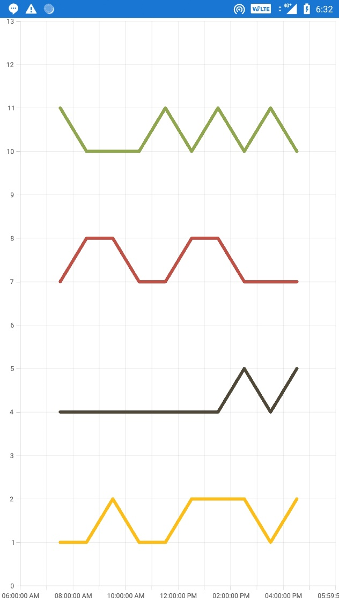

# How to draw the line series with round cap


It has been achieved by using CustomRenderer by extending the LineSegmnt. Please refer below code snippet. 
 
## PCL
``` 
public class ChartExt : SfChart 
    { 
 
    } 
 ```   
 
## Code snippet for Android [C#]
```
[assembly: ExportRenderer(typeof(ChartExt), typeof(CustomChartRenderer))] 
namespace SimpleSample.Droid 
{ 
    public class CustomChartRenderer : SfChartRenderer 
    { 
        protected override void OnElementChanged(ElementChangedEventArgs<Syncfusion.SfChart.XForms.SfChart> e) 
        { 
            base.OnElementChanged(e); 
        } 
 
        public override SfChartExt CreateNativeChart() 
        { 
            return new CustomChart(Android.App.Application.Context); 
        } 
    } 
 
 
    public class CustomChart : SfChartExt 
    { 
        public CustomChart(Android.Content.Context context) : base(context) 
        { 
 
        } 
 
        protected override Com.Syncfusion.Charts.ChartSeries CreateNativeChartSeries(Syncfusion.SfChart.XForms.ChartSeries formSeries) 
        { 
            if (formSeries is Syncfusion.SfChart.XForms.LineSeries) 
            { 
                return new CustomLineSeries(); 
            } 
            return base.CreateNativeChartSeries(formSeries); 
        } 
 
    } 
 
    public class CustomLineSeries : Native.LineSeries 
    { 
        Native.SeriesRenderer seriesRenderer; 
 
        protected override Native.ChartSegment CreateSegment() 
        { 
            return new CustomLineSegment(); 
        } 
 
        protected override void OnAttachedToChart() 
        { 
            base.OnAttachedToChart(); 
            seriesRenderer.SetLayerType(Android.Views.LayerType.Software, null); 
        } 
 
        protected override Native.SeriesRenderer GetView() 
        { 
            seriesRenderer = base.GetView(); 
 
            return base.GetView(); 
        } 
    } 
 
    public class CustomLineSegment : Native.LineSegment 
    { 
        private readonly float width = 5; 
        Paint paint = new Paint(); 
 
        public override void OnDraw(Canvas canvas) 
        { 
            
            paint.StrokeWidth = this.Series.StrokeWidth + width; 
            paint.Color = this.Color;  
            paint.StrokeCap = Cap.Round; 
            canvas.DrawLine(this.X1, this.Y1, this.X2, this.Y2, paint); 
        } 
    } 
} 
```

## Code snippet for iOS [C#]

```
[assembly: ExportRenderer(typeof(ChartExt), typeof(CustomChartRenderer))] 
namespace SimpleSample.iOS 
{ 
    public class CustomChartRenderer : SfChartRenderer 
    { 
        protected override void OnElementChanged(ElementChangedEventArgs<SfChart> e) 
        { 
            base.OnElementChanged(e); 
        } 
 
        public override Native.SFChart CreateNativeChart() 
        { 
            return new CustomChart(); 
        } 
 
    } 
 
    public class CustomChart : Native.SFChart 
    { 
        protected override Native.SFSeries CreateNativeChartSeries(ChartSeries formSeries) 
        { 
            if (formSeries is LineSeries) 
            { 
                return new CustomLineSeries(); 
            } 
 
            return base.CreateNativeChartSeries(formSeries); 
        } 
    } 
 
    public class CustomLineSeries : Native.SFLineSeries 
    { 
        protected override Native.SFChartSegment CreateSegment() 
        { 
            return new CustomLineSegment(); 
        } 
    } 
 
    public class CustomLineSegment : Native.SFLineSegment 
    { 
 
        CGPath path = new CGPath(); 
        
        public override void DrawSegment(CGContext context) 
        { 
            context.SaveState(); 
            context.SetLineCap(CGLineCap.Round);  
            base.DrawSegment(context); 
            context.RestoreState(); 
        } 
         
    } 
 
} 
```

## Code snippet for UWP [C#]

```
[assembly: ExportRenderer(typeof(ChartExt), typeof(CustomChartRenderer))] 
namespace SimpleSample.UWP 
{ 
     public class CustomChartRenderer : SfChartRenderer
    {
        protected override void OnElementPropertyChanged(object sender, PropertyChangedEventArgs e)
        {
            base.OnElementPropertyChanged(sender, e);

            if (Control != null)
            {
                SetLineJoinEffect(Control.Series);
            }
        }
        private void SetLineJoinEffect(Native.ChartSeriesCollection chartSeries)
        {
            foreach (var series in chartSeries)
            {
                Native.LineSeries lineSeries = series as Native.LineSeries;
                if (lineSeries != null)
                {
                    var segment = typeof(Native.ChartSeriesBase).GetField("Segments", BindingFlags.GetField | BindingFlags.Instance | BindingFlags.NonPublic).GetValue(lineSeries) as ObservableCollection<Native.ChartSegment>;
                    if (segment != null)
                    {
                        foreach (var lineSegment in segment)
                        {
                            var segPath = lineSegment.GetRenderedVisual();
                            if (segPath != null)
                            {
                                (segPath as Line).StrokeStartLineCap = PenLineCap.Round;
                                (segPath as Line).StrokeEndLineCap = PenLineCap.Round;
                            }
                               
                        }
                    }
                }
            }
        }
    }
} 
``` 
 

## Screenshot
  
 